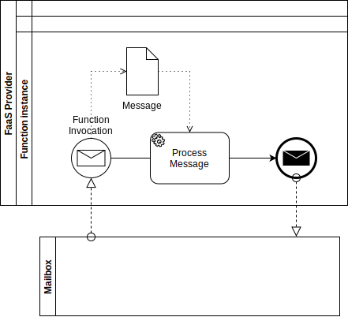

# Thesys

Consigli prof Margara

1. INTRODUCTION

Riassunto di alto livello (2/3 pagine nelle tesi normali)

2. BACKGROUND AND MOTIVATION

Possono essere anche due capitoli (di solito la motivation viene da se nel momento in cui si spiega bene background e problemi relativi)

NIENTE DI MIO, SOLO DESCRIVERE L’ESISTENT

Due problemi (serverless function)

- astrazione

- performance

3. DESIGN

Esporre le scelte possibili, considerando I trade off

4. IMPLEMENTATION

Descrivere il motivo delle scelte e I trade off

5. EVALUATION

Riprendere le motivazioni

obiettivo (altissimo livello), dimostrare di aver superato I

problemi del cap 2

trovare le domande.

Spiegare il setup dell’esempio usato per rispondere numericamente alla domanda.

6. RELATED WORKS

A differenza di background, lavori che potrebbero rispondere pi’u o meno allo stesso quesito, ma che non sono stati direttamente considerati nel design.

Non confrontabili direttamente (correlati), causa assunzioni diverse ecc…

---

1 Introduction

[…]

2 Actor programming model

The Actor Model is a message passing concurrency model

it was originally proposed by Hewit at al. In 1973.

It treats an actor as the fundamental building block of concurrent computation

embraces the philosophy that “everything is an actor”, akin to the concept of "everything is an object" in Object-Oriented Programming.

2.1 Fundamental concepts

An actor represents an autonomous computational entity

An actor system is composed by a variable set of actors and the communication is founded on message passing.

an actor, upon creation, awaits new messages to process.

in response to a received message, it can:

    • Create a finite number of new actors.

    • Send a finite number of messages to other actors.

    • Designate the behaviour to be used for the next message it receives.

These actions are not bound by any assumed sequence and can be carried out in parallel.

Message passing

The communication between actors happens through message passing

a message is the basic unit of communication

the communication is asynchronous

There is no need for coordination between sender and receiver

Once a message is sent, there is no blocking state, and the actor can continue with its current computation.

there is either no constraints on the order of message arrivals. For instance, if actor X sends message M1 to actor Y and later sends another message M2 to Y, there is no requirement that M1 must arrive at Y before M2

each actor has a mailbox, in which received messages are stored waiting to be executed

this was not provided by the original model but was later added for implementation purposes

a mailbox can be considered a simple message queue

there is no requirement on how messages should be processed from the mailbox

it can happen in order or not

Addressing

in order to receive messages, each actor have an address, or name

address is not an identifier: two actors may have the same ID but different addresses.

an actor can only communicate with actors whose addresses it knows

to send a message when processing a received one, an actor can target addresses

    1. that it receives in the message

    2. that it already had before it received the message

    3. that it creates while processing the message.

Because of this property, the actor model facilitates location transparency

the concept of address can be seamlessly extended from local to remote

State changes

Actor behaviour, that is what to do in response of messages, depends on the internal state

that is mutable, so the behaviour can change over time

the state of an actor is isolated and cannot be modified by other actors directly

an actor itself is only able to change his state

There is no possibility for an actor to change the behaviour of another one, outside sending him a message.

This property enforce for the developer a strong concurrency guarantees: data races are ruled out by design.

The actor model inherently facilitates fault tolerance through the isolation of state within actors.

When an actor encounters an error or failure, it does not affect the entire system,

this allow graceful recovery and error handling.

2.2 Practical implementations

The model has been used both as a framework for a theoretical understanding of concurrency, and as the theoretical basis for several practical implementations of concurrent systems.

Dalla prima formulazione del modello, si sono susseguite negli anni diverse implementazioni, sia come linguaggi di programmazione, che di librerie e framework.

Alcuni esempi notevoli sono Erlang, il primo ad essere largamente usato in industria, e Akka, una delle implementazioni al giorno d’oggi piu’ conosciute.

I caratteri fondamentali del paradigma sono stati talvolta modificati nelle varie implementazioni, in base alle esigenze.

2.2.1 Virtual actors

Una delle implementazioni piu’ rilevanti e’ Orleans

Orleans was developed by Microsoft Research and was made available as open source in 2015.

it proposes the concept of virtual actor as an evolution of the traditional one

a virtual actor is a logical entity always alive

this mean that it is not explicitly created or destroyed, and is not affected by server failures.

This abstraction is provided by the runtime

it automatically creates instances of an actor as soon as a request for a not-yet-instantiated actor arrives

it takes care also of garbage collection automatically removing actors that are no longer in use

because of this, Virtual actors can be instantiated in different locations (servers) at different times

or they might not have any specific physical location at all.

In this way actor location is transparent: it is enough to know the actor identifier in order to refer to it

virtual actors are similar to OOP objects

they have a fixed interface and messages should

the state is represented as a set of internal and private variables

the difference is that each actor runs in a separate thread and

Each "activation" of a virtual actor is bound to a single thread and works in turns, meaning that only one task (e.g., method invocation or promise resolution) is processed at a time. This fine-grained concurrency control ensures thread safety and prevents concurrent modification issues.

Furthermore, to provide durability for actor state, each actor class can define an interface representing the state to be persisted. The runtime then supplies each instance of the class with a state object that implements this interface. Developers can define methods to persist and refresh the state. The decision of when to perform a checkpoint and save the state to storage is under the application's control. Storage interactions occur through persistence providers, which serve as adapters for different types of databases (e.g., SQL, column-based, blob storage, etc.).

In summary, the virtual actors programming model builds upon the strengths of the actor model while addressing its limitations. By introducing the principles of automatic instantiation, location transparency, and automatic scale-out, virtual actors provide a powerful and scalable foundation for building distributed, fault-tolerant, and efficient systems. The asynchronous and interface-based communication further simplifies the development of robust and concurrent applications.

allows developers to focus on writing business logic instead of dealing with low-level details

Caratteristiche fondamentali di Orleans (poche righe).

Apre la strada per l’implementazione degli attori in un ambiente cloud, esso sta alla base per implmentazioni piu’ recenti in ambienti cloud, come Service Fabrique Reliable Actors

2.3 Difficolta’ implementative

I framework che implemenetano il paradigma ad attori impongono al programmatore la gestione di vari problematiche di per se’ indipendenti dalla business logic.

Il programmatore dovrebbe occuparsi solo della business logic.

Alcune limitazioni sono legate all’astrazione del modello ad attori

Ciclo di vita degli attori

Molte implementazioni tradizionali, impongono una gestione diretta del ciclo di vita degli attori

in linguaggi come Erlang e Kilim, gli attori sono associati a un processo,

in quanto tale esso deve essere esplicitamente creato e distrutto

anche in akka e’ necessaria una gestione simile

Orleans introduce il concetto di attori virtuali, come entita’ che non devono essere create ne’ distrutte

tali entita’ nascono nel momento in cui vengono invocate la prima volta, cioe’ quando un attore invia loro un messaggio

Failure e recovery

Tale concetto si collega alla gestione del ciclo di vita

colui che crea un attore ne e’ anche responsabile in caso di failure

tale concetto prende il nome di supervision e avviene in tutti I linguaggi citati nel precedente paragrafo

il programmatore deve dunque esplicitamente gestire il comportamento del supervisor e riavviare un attore supervisionato in caso di failure.

Anche in questo caso

garbage collection

locazione degli attori

risorse distribuite

da un punto di vista piu’ di basso livello, alle suddette difficolta’ si aggiungono quelle legate all’infrastruttura

    • mantenimento dell’infrastruttura

    • scalabilita’

    • provisioning delle risorse

La ricerca attuale si propone di superare queste problematiche attraverso un’astrazione del modello ad attori basato sul modello degli attori virtuali applicato alle funzioni serverless.

3 Serverless Computing

Serverless computing is an evolution in the cloud computing model that removes the burden of server management and infrastructure considerations from developers. Despite its moniker, 'serverless' does not mean the complete absence of servers. Instead, it refers to a paradigm shift that allows developers to focus their efforts on developing code for distinct functions or services.

This model stands in stark contrast to traditional server-based architectures, where the onus of computing resources estimation, server setup, and handling of variable demand falls upon developers. In a serverless architecture, these responsibilities are transferred to the cloud provider.

The cloud provider is in charge of automatically provisioning the resources necessary to execute functions and dynamically scales them according to the demand, down to individual function calls. This characteristic of on-demand scalability and resource provisioning significantly increases the efficiency of serverless computing, rendering it a more cost-effective solution compared to traditional models.

3.1 Function-as-a-Service

At the core of serverless computing are serverless functions, also known as Function as a Service (FaaS). These functions are individual units of code designed to perform specific tasks or services. When invoked, the cloud provider automatically handles the entire execution lifecycle of these functions, including resource allocation, scaling, and monitoring.

Serverless functions are designed to be stateless, meaning they do not retain any state between invocations. This architectural choice encourages developers to build loosely coupled and scalable applications, embracing best practices like microservices. While the statelessness of serverless functions can be limiting in certain scenarios, their agility and cost-effectiveness have made them a popular choice for building event-driven and highly scalable applications in modern cloud environments.

3.2 Advantages of Serverless Computing

[What serverless computing is and should become: the next phase of cloud computing]

Serverless computing provides many advantages>

    • Cost Efficiency: One of the most significant advantages of serverless computing is its cost efficiency. Traditional server-based models often require overprovisioning to handle peak loads, leading to unused resources and unnecessary expenses. In a serverless architecture, you pay only for the actual compute time and resources used during the execution of functions. This "pay-as-you-go" model ensures that you are billed based on the actual usage, resulting in cost savings for applications with variable workloads.

    • Scalability and Flexibility: Serverless architectures provide unparalleled scalability. Cloud providers automatically handle the scaling of functions based on the number of incoming requests. As the load increases, more instances of the function are spawned to accommodate the demand, ensuring responsiveness and reliability. Conversely, during periods of low traffic, resources are automatically deallocated, saving costs.

      The flexible nature of serverless functions allows developers to focus on writing code and building applications without worrying about the underlying infrastructure. It fosters agility, enabling rapid development and deployment cycles.

    • Reduced Operational Overhead: Managing servers, monitoring performance, and handling infrastructure issues can be time-consuming and resource-intensive. With serverless computing, the cloud provider takes care of these operational tasks, allowing developers to focus on creating value through their code. This reduces the burden on operations teams, freeing them to concentrate on more strategic initiatives.

3.3 Serverless Functions implementation and limits

In practical implementation, serverless functions are ephemeral, on-demand instances that are invoked by triggers and run on stateless compute containers managed by the cloud provider. One significant limitation associated with serverless functions is the "cold start" issue. Cold starts occur when a function hasn't been invoked recently, causing the cloud provider to instantiate a new container. This instantiation can lead to latency, which can be a critical issue for performance-sensitive applications.

Several strategies are often employed to mitigate cold start latency. One common approach is to keep functions "warm" by scheduling regular invocations, which prevent the underlying containers from going idle. However, this approach may incur additional costs due to the regular function invocations. Alternatively, increasing the allocated memory for functions can speed up the startup process. Furthermore, some cloud providers offer premium tiers or specific solutions to reduce cold start times. Finally, depending on the use case, re-architecting the application to reduce the impact of cold starts on user experience might be the most effective solution. This could involve, for example, moving non-user facing tasks to serverless functions, while keeping user-facing tasks on always-on servers.

4 Actor paradigm in serverless environment

The serverless model could provide substantial advantages when applied to actor programming. In general, these benefits arise from the inherent qualities of the serverless computing paradigm.

In the following sections, we will explore the similarities between the two models, highlighting both their potential advantages and the challenges they present.

4.1.1 Similarities between the actor model and serverless functions

The proposed integration of the actor model and serverless functions is underpinned by numerous shared characteristics, which make these two paradigms complementary in many respects.

    • Distribution: The actor model is a highly distributed system, a trait it shares with serverless computing. In an actor system, different actors (or functions) can be executed across a variety of machines. Similarly, serverless functions are designed to run across a distributed network of ephemeral containers. For instance, in a distributed video encoding application, each actor or serverless function could be responsible for encoding a different segment of the video.

    • Isolation: Both models advocate for isolation. Actors are isolated units of computation with their own state, just as serverless functions are independent units of execution, each operating in its own container.

    • Communication: The communication between actors through message passing mirrors the interaction between serverless functions via invocations. In an e-commerce application, for example, an actor or a serverless function that manages inventory could send a message or invoke another actor or function responsible for billing when a purchase is made.

    • Location transparency: A significant attribute in the actor model, also plays a key role in serverless functions. In the serverless environment, programmers are agnostic of the physical location of the machine executing the code, just as in the actor model where actors interact with each other irrespective of their locations in the network.

    • Scalability: In the actor model, a system can spawn a multitude of actors to handle an influx of requests. Similarly, serverless functions can scale potentially infinitely, with cloud providers instantiating functions based on load.

    • Concurrency: Both models can handle high levels of concurrency. In the serverless paradigm, the load can trigger the execution of a potentially unlimited number of serverless functions concurrently. Similarly, in an actor model, multiple actors can handle various tasks simultaneously.

    • Fault tolerance: The actor model has built-in mechanisms for error handling and recovery, complementing the robustness of serverless platforms. In a serverless actor system, if an actor (i.e., a serverless function) fails, it can be restarted without affecting the rest of the system, thereby enhancing system reliability.

When considering the virtual actor model instead of the “classical” one, further similarities emerge:

    • The instantiation of a virtual actor resembles the invocation of a serverless function, just as the sending of a message, given that in this extension actors doesn't need to be explicitly created.

    • As there is no strict hierarchy of actors in the virtual actor model, there is no need to replicate this abstraction in serverless functions, which are inherently flat. This eliminates the need to impose a hierarchy on serverless functions, further simplifying their implementation.

In summary, the concept of a virtual actor aligns closely with that of a serverless function, and these similarities make the integration of these two models a promising avenue for concurrent and distributed system design.

4.1.2 Additional benefits

Building upon the previously discussed points, the utilization of serverless functions stands to markedly augment the actor paradigm in its conventional dual implementations. This amplification can be perceived in multiple key domains such as:

- Cost-effectiveness: The pay-as-you-go model of serverless computing, where you only pay for the computing time you consume, coupled with the actor model's efficiency in resource management by only invoking actors when needed, could potentially result in significant cost reductions.

- Simplified Development and Maintenance: The fusion of the actor model with serverless computing can simplify the developmental procedures. Developers can concentrate on individual actors (functions) without being burdened with the details of the underlying server infrastructure. This may lead to simpler application maintenance and updates since changes in one actor don't impact others.

- Flexibility: The possibility of implementing different actors in different languages ties in with the increased freedom given to programmers by the serverless paradigm. This allows for choosing the best language for the task at hand, thereby enhancing the flexibility and efficiency of the system.

### 4.1.3 Implementation Challenges

While there are many significant and remarkable similarities between the actor and serverless models, there also exist certain differences that are not easily overcome. The endeavour to overcome these disparities is what lays the foundation and purpose of the work presented in this thesis. Below, we summarise these challenges:

- Actor-to-function mapping: Despite the parallels, the concept of an actor and a serverless function cannot be considered in a one-to-one relationship, where one actor corresponds to one serverless function.

- Actor instantiation: There is a need to represent the act of instantiating an actor within the serverless context.

- Message dispatching: While a message can be easily equated to an HTTP call, it is crucial to define what constitutes such a call and, importantly, how it can be addressed.

- Extending the previous point, we need to clarify what is meant by an actor's address in this new context, and generally how actors are identified.

- Message queue management: Dealing with the queue of messages within the serverless model poses its own set of challenges.

- State persistence: Generally, actors are stateful, while serverless functions are stateless. This is one of the most challenging points.

- Tied to the concept of persistence, there's the question of how to implement fault tolerance in the proposed system.

- Performance: The 'cold start' issue of serverless functions can affect the performance of the overall system.

- Simplicity of implementation: Striking the right balance between functionality and ease of implementation is an ongoing challenge.

These points of contention require careful attention and innovative solutions to integrate the serverless and actor models successfully. Each presents unique challenges that need to be addressed to make the most of the advantages that each model offers.

# 5. Astrazione

Si vuole definire l’astrazione del paradigma ad attori che si utilizza.

Si parte dall’astrazione degli attori virtuali, gia’ accennata nel capitolo xx

con alcune variazioni

RIPRENDERE TUTTI I CONCETTI, SPIEGATI NEL DETTAGLIO

### Attori

(actor lifecycle)

attori virtuali, non devono essere esplicitamente creati ne’ distrutti

per creare un attore e’ sufficente invocarlo la prima volta

se un attore non viene invocato da tempo, le risorse allocate sono liberate automaticamente (garbage collection)

(location trasparency)

per riferirsi a un attore e’ sufficiente avere il suo identificativo

ogni attore e’ univocamente individuato attraverso il suo identificativo

il sistema e’ trasparente rispetto alla posizione fisica dell’attore

(fault tolerance)

I failure del sistema sono gestiti automaticamente

in caso di failure, ripristinare automaticamente gli attori coinvolti

(comunication semantic)

la semantica della comunicazione e’ esattamente uno

nonostante I failure, ogni messaggio viene inviato un unica volta

la comunicazione e’ ordinata

se un attore spedisce due messaggi in serie allo stesso destinatario, tali messaggi vengono accodati nella mailbox del destinatario in ordire.

(scalability)

l’istanziazione di attori viene gestita automaticamente dal sistema

l’aumento della richiesta di risorse nel sistema porta ad un aumento della capacita’ computazionale

(manutenzione)

### Stato

Lo stato di un attore e’ rappresentato da un insieme di variabili, semplici o complesse

tali variabili sono immagazzinate in una locazione di memoria

lo stato di ogni attore e’ isolato da quello degli altri

non e’ possibile nei messaggi mandare dei riferimenti a delle variabili di stato

l’unico modo per condividere lo stato e’ attraverso un deep copy dello stesso

Turni

l’esecuzione di un attore si svolge in turni

un turno consiste nella lettura e gestione di un messaggio

ogni turno ha una lunghezza variabile

essendo lo stato degli attori isolato, I turni si svolgono in isolamento.

### Mailbox

Ogni attore possiede una mailbox

I messaggi inviati ad un attore vengono accodati nella mailbox

un attore processa I messaggi della propria mailbox in ordine di arrivo

una mailbox corrisponde a una coda fifo

se viene inviato un messaggio ad un attore ma ci sono gia’ messaggi nella mailbox, esso verra’ gestito non appena tutti gli altri messaggi sono stati processati

### Comunication

La comunicazione e’ asincrona

quando un attore invia un messaggio, continua la sua esecuzione, senza aspettare una risposta o un hack di ricezione da parte dell’attore target

la semantica della comunicazione e’ esattamente uno

nonostante I failure, ogni messaggio viene inviato un unica volta

la comunicazione e’ ordinata

se un attore spedisce due messaggi in serie allo stesso destinatario, tali messaggi vengono accodati nella mailbox del destinatario in ordire.

# Design

Il primo passo e’ capire cosa rappresenta l’esecuzione di una funzione serverless nel contesto della programmazione ad attori

l’esecuzione di una funzione serverless corrisponde a un turno dell’attore, inteso come il processing di un messaggio.

La funzione serverless puo’ quindi essere intesa come uno dei metodi dell’interfaccia dell’attore.

L’input della funzione e’ il messaggio che deve essere processato

non essendo l’attore tenuto a dare una risposta al messaggio ricevuto, tutti I metodi della sua interfaccia sono void.

essendo I metodi dell’interfaccia dell’attore void, la funzione serverless non restituisce nulla

in questo contesto, l’invocazione di una funzione serverless corrisponde all’invio di un messaggio

se un attore x vuole inviare un messaggio M all’attore y allora invochera’ la corrispondente funzione serverless passando come parametro il contenuto del messaggio

si ha quindi che l’invio di un messaggio corrisponde ad una chiamata http

### Addressing

abbiamo parlato di funzione serverless corrispondente a un attore

vediamo nel dettaglio

come si identifica l’attore destinatario?

Bisogna chiarire il concetto di address

si tratta di un punto centrale

ogni attore puo’ appartenere a una classe

una classe di attori definisce il comportamento generico dell’attore

in seguito ci riferiremo ad una classe di attori con il termine tipo di attore, per non confondersi con la programmazione OO

due attori di uno stesso tipo differiscono tra loro per lo stato interno

_esempio contatore:_

supponiamo di avere un tipo di attore “contatore”, il cui comportamento consiste nel contare il numero di invocazioni.

due attori X e Y appartenenti alla suddetta classe possono essere stati invocati un numero di volte diverso, pur condividendo lo stesso comportamento

per esempio l’attore X puo’ essere stato invocato 4 volte, l’attore Y 7 volte.

Ogni classe di attori e’ associata a una funzione serverless

tornando all’esempio, ci sara’ una funzione serverless “contatore”.

In questo esempio semplificato essa puo’ ricevere solo un tipo di messaggio, cioe’ “incrementa contatore”

per completezza estendiamo il comportamento aggiungendo un secondo tipo di messaggio accettato: “decermenta contatore”

il codice della funzione potrebbe quindi essere una cosa del tipo

    void contatore(msg) {

        switch (msg) {

            case “incrementa”: stato +=1;

            case “decrementa”: stato -= 1;

            default: throw Error(“messaggio non riconosciuto”);

        }

    }

cosi’ facendo chiunque invochi la funzione contatore provochera’ l’incremento dello stato interno

lasciamo per un momento da parta il concetto di stato

lo vedremo nel dettaglio nel prossimo paragrafo

c’e’ tuttavia un problema evidente

secondo quanto detto finora, non e’ possibile differenziare tra diversi attori appartenenti a una stessa classe

per risolvere questo problema si suppone che ad ogni funzione rappresentante una classe di attore sia necessario mandare, oltre al messaggio, l’identificatore dell’attore con cui si vuole effettivamente interagire

la funzione sara’ quindi una cosa del tipo

    void contatore(id, msg) {
        var stato = getState(id)
        switch (msg) {
            case “incrementa”: stato +=1;
            case “decrementa”: stato -= 1;
            default: throw Error(“messaggio non riconosciuto”);
        }
    }

in questo modo si va a modificare esclusivamente lo stato associato all’attore desiderato

vediamo quindi un esempio completo dell’invio di un messaggio da parte di un attore x.

per poter effettuare tale operazione, l’attore x dovra’ conoscere sia la classe dell’attore y che il suo identificativo

cosi’ facendo esso mandera’ il messaggio attraverso la chiamata POST

host/api/<classe>

body: {

    “id”: <id>,

    “message”: <messaggio>

}

l’unico check da fare e’ che il messaggio sia arrivato a destinazione, non bisogna aspettare altro

dopo questa conferma l’attore puo’ continuare la sua esecuzione

l’isolamento degli attori e’ garantito nel momento in cui in tali richieste non vengono passati dei riferimenti di memoria ma delle deep copy della struttura dati.

Mailbox

Per completare il quadro a livello architetturale manca la mailbox

invocando una funzione serverless si ottiene il processing immediato del messaggio.

In certi casi questo comportamento non va bene in quanto non conforme al paradigma ad attori

se vengono ricevuti due messaggi indirizzati allo stesso attore, essi devono essere processati in serie

vediamo le tre possibili casistiche, con relativo comportamento desiderato

I colori rappresentano il tipo di attore, le lettere gli identificativi

I due messaggi sono indirizzati a due attori di tipo diverso, vengono dunque coinvolte due funzioni serverless eseguite in parallelo

I due messaggi sono indirizzati a due attori diversi ma dello stesso tipo, in questo caso il processing avviene in parallelo su due istanze della medesima funzione

I due messaggi sono indirizzati allo stesso attore e non possono essere eseguiti in parallelo. In questo caso vanno accodati e processati in serie.

e’ dunque necessario inserire un meccanismo di coda che faccia da proxy tra la ricezione di un messaggio e la sua effettiva consumazione

dal punto di vista concettuale, ogni attore deve avere una coda privata

Gestione dello stato

Passiamo ora all’analisi di uno dei concetti piu’ delicati

le funzioni serverless sono di natura stateless

e’ necessaria un’astrazione che permetta loro di operare direttamente sullo stato (aggiornato) dell’attore

il modello pensato consiste nel caricare lo stato attuale nella memoria locale della funzione prima dell’esecuzione, e di salvarlo al termine

questa soluzione permette di eseguire un’azione in modo atomico

nel caso in cui la funzione fallisca durante l’esecuzione del messaggio, nessun risultato verra’ salvato

in questo modo si elimina il rischio di operazioni incomplete

ad altro livello si avra’ quindi questa situazione

nella fase di caricamento dello stato e’ necessario conoscere l’identificativo dell’attore, di modo da caricare lo stato corretto

allo stesso modo, e’ necessario averlo nel momento in cui lo stato viene salvato

una volta caricato lo stato, la fase di processing del messaggio e’ comunque a tutti gli attori di questo determinato tipo, di conseguenza e’ sufficiente il messaggio.

Sorge a questo punto naturale un’ulteriore questione

da dove viene caricato lo stato e dove viene poi salvato?

concetti:

- garbage collection. Non necessaria: quando il container in cui l’attore e’ “istanziato” viene distrutto, le risorse volatili associate all’attore vengono distrutte. Questo potrebbe essere un problema in quanto non viene deciso programmaticamente ma in generale e’ nelle mani del cloud provider. Visto il meccaniamo di fault tolerance imlementato non e’ necessario preoccuparsene.

- tecnlogie necessarie: provider di faas, sistema a coda che permetta 1) di gestire code diverse per I vari attori e 2) di fare event sourcing (serve quindi un event store)

  6.2 Serverless functions as actors

  6.2.1 Mapping actor - function

Since we want to execute actors through serverless functions, we should first of all map the concept of actor to the concept of function.

An actor is an entity that reacts to messages, and, depending on the internal state, make some computation in response of it.

So, it can be easily mapped as a stateful function that takes a message as parameter and produces no result.

To be more precise, a function represent a class of actors that behaves in the same way.

Nevertheless, an actor can be in a different state wrt other instances of the same class

For this reason we should provide an identifier for each actor

in order to make the function aware of the instance it’s going to personify, we should provide to it not only the message to handle but also the identifier of the actor instance

from a practical perspective, we should create a serverless function for each class of actor in our project, and make them receive two arguments, a message and a identifier, as parameters.

6.2.2 Going serverless

The proposed mapping seems straightforward, anyway serverless functions imposes some limitations.

We want to understand if and how a serverless function can acts as an actor.

First of all, analyse what an actor can do after receiving a message

- send messages to other actors

- make computations

- update internal state

there are two critical point

6.2.3 Actor communication

We should define a protocol for message communication

the action to send a message is modelled as invoking a serverless function.

This happened through an API that depends on the serverless function provider

in any case it can be done in a serverless function

following the principle of virtual actors, there is not the need to explicitly create new actors, it is enough to send them a message

6.2.4 Read and persist actor state

This is the most tricky point

actors are stateful objects, so we need a stateful environment

serverless functions are structurally stateless

should find a way to make serverless functions stateful

the literature is large about this point

(examples from literature)

(trying )

a solution is to fetch the state from a remote storage, run the function with the fetched state and then save again the state for next executions

this way is not top from the point of view of performance

the better way would be to save the state locally

to do this we can use the fact that serverless functions run on containers, with a local storage

containers are not suddenly destroyed after each execution, to alleviate the problem of cold start (explain)

for this reason, it is potentially possible to compute many messages sent to the same actor instance in the same container, and so with the same memory

6.3 Persistence

the problem is that we does not know in which container a new function is executed

in other words, we cannot be sure that the stored state is the one of the particular actor instance

another problem is that an actor instance can be executed in different containers during it lifetime, so the local state can be not updated

the only possible way is to force actors instance to be bound to a particular container

every message sent to an actor instance should be always executed on the same container, so that the local state is updated

[...]

6.4 Message delivery

every actor instance should process messages one after the other

for this reason it is important to preserve the ordering of execution of messages

most serverless functions providers are able to spawn a (theoretically) infinite number of execution environments, depending on the number of the received execution request

for this reason, if three messages are sent at the same time to the same actor instance, three execution environments will be spawn to execute the requests concurrently

in general, this behaviour is good because it speed up the handling of the request, anyway in our case it does not respect the actor paradigm

the handling of messages sent to the same actor instance should happen synchronously

another theme is the message ordering

in serverless functions it is not guaranteed to be respected

in our case, every actor instance should receive and execute messages in order

to solve those problems we should add a layer before the serverless execution that manages the messages arrival

we can put messages in a fifo queue, and process them one by one

it is not important to preserve ordering for messages directed to different actor instances, just for those directed to the same instance

a solution can be to manage a different queue for each actor instance

graphically the behaviour is the following (graph)

messages in different queues can be delivered concurrently, the important thing is to preserve order in the single queues

6.5 Persistence

7.  Implementation

7.1 technologies

7.1.1 OpenWhisk

7.1.2 Kafka

7.2 test: AWS Lambda

7.3 OpenWhisk

7.4 CLI

8 Evaluation

9 Related work

Durable entities

You focus on the code that matters most to you, in the most productive language for you, and Azure Functions handles the rest. PUT ON RELATED WORKS
